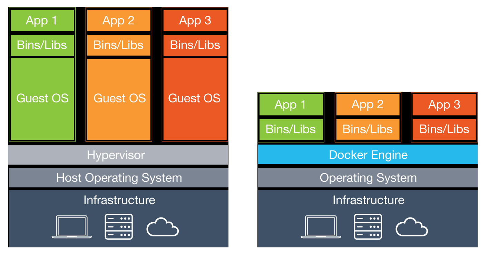

# Docker Workshop

## Preparation
1. install [docker for mac](https://docs.docker.com/docker-for-mac/)
2. get an idea of [what is docker](https://www.docker.com/what-docker)
  - Lightweight

  
  - Open Standards

  &nbsp; vs &nbsp;

## Steps
### Step#1 [Get started with docker basic commands](./docs/step-1.md)
### Step#2 [Link two running docker containers](./docs/step-2.md)
### Step#3 [Get started with docker-compose](./docs/step-3.md)
